# Live配信

## 要件
* 高い位置から俯瞰した映像
* 丸１日の長時間配信
* 肖像権考慮で顔がはっきりわからないこと

## 検討

## 選定
案３のWebCamでの配信
### 理由
* USB-Cは電源から離せない為、設置場所が限定的になる
* USB3.0であれば延長可能（10M実績あり）

## 必要物品
|品目|台数|備考|
|---|---|---|
|ノートPC|1||
|WebCam|1|USB3.0規格のもの|
|USB3.0延長3M|1||
|youtubeアカウント|1|live配信用|
|電源|1|PC給電用|

## Youtube Live
### 前提
* YouTubeアカウント・YouTubeチャンネルの準備
    注）YouTube live配信はライブ配信の24時間前にアカウントの本人確認作業を行う必要があります。
### 設定
#### YouTube live側の事前設定
##### Live配信枠を作成する
YouTubeにログインをして、右上のアイコンから「ライブ配信を開始」をクリックします。「新しいライブ配信」をクリックして、ライブ配信内容を設定し、「エンコーダー配信を作成」をクリックしてください。ライブ配信予約が完了されます。
|項目|設定|
|---|---|
|タイトル|配信タイトルを入力してください|
|公開 |公開：だれでも閲覧をすることができます 限定公開：リンクを知っている人のみに公開されます（検索エンジンではヒットしません） 非公開：自分のみ閲覧できます|
|説明|動画の説明文や詳細を入力してください|
|ブログ|動画のタイプを選択してください|
|後でスケジュール設定|スケジュールを設定します|
|カスタムサムネイルをアップロード|YouTubeからの視聴者が配信までの間の待機時間に表示されるサムネイルを設定できます|
|視聴者||

#### ライブ配信時に行うこと
#### ライブ配信終了時に行うこと
#### 注意すべきこと
1. YouTubeのURLは一回使うと無効になる
YouTubeのURLは一度使用してしまうと無効になってしまいます。一度配信して停止したURLも無効になってしまいますので、テスト配信をする際は本番用のURLではなく、テスト配信用のURLを発行するようにしましょう。
2. 配信が途切れる
原因はさまざまですが、インターネット環境により配信が途切れてしまったり、YouTube live配信がかなりの遅延を起こしてしまったりしたことがありました。